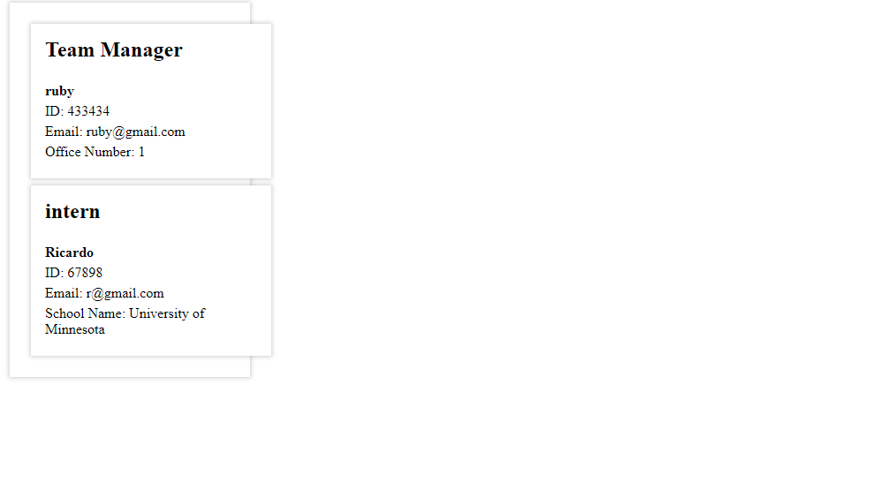

# TeamProfileGenerator
## Description

Provide a short description explaining the what, why, and how of your project. Use the following questions as a guide:

- What was your motivation? My motivation for this project was to learn how to use all the material together. Here I implented classes and practiced modularization. 
- Why did you build this project? I built this project because I want to become a better developer by practicing these concepts together.
- What problem does it solve? This app makes it easier to put infromation together. 
- What did you learn? I got a better understanding on how to use classes and modularization.
 - Things I wish I could have completed? I wasn't able to style more, and fix isuues that I had. 

   ## Mockup
    
    
   

## License

## Badges

